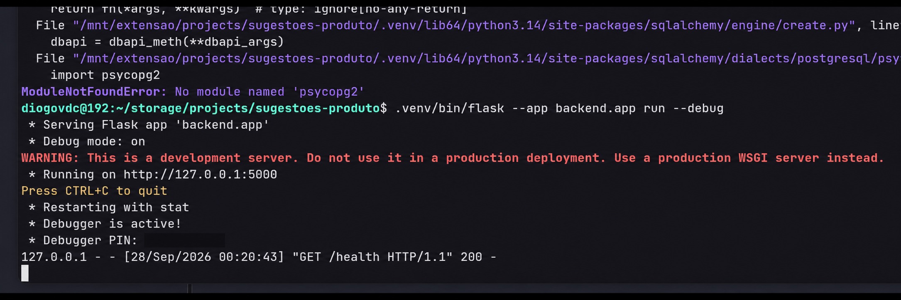
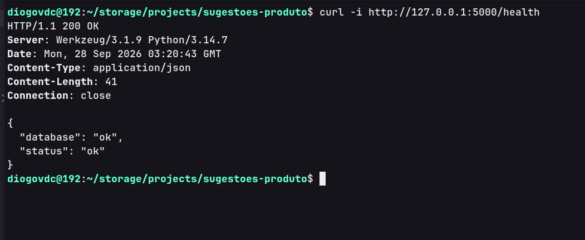

# Sugestões de Produto

API e interface web para cadastrar, comentar, votar e acompanhar sugestões de melhorias de um produto. A aplicação centraliza propostas, registra discussões e permite acompanhar o status de cada sugestão.

> **Estado do projeto:** etapa 1 implementada e validada localmente. O backend Flask inicia, conecta ao PostgreSQL e disponibiliza `GET /health`. Os modelos, as demais rotas, as integrações de IA e a interface serão implementados nas próximas etapas.

O plano detalhado, com cinco etapas e critérios de conclusão, está em [PLANO.md](PLANO.md).

## Instalação e configuração — etapa 1

Os comandos abaixo devem ser executados a partir da raiz do projeto, em um terminal Linux. É necessário ter Python 3, PostgreSQL instalado e em execução, o cliente `psql` e `curl`. A execução registrada nesta etapa utilizou Python 3.14.7.

### 1. Preparar o ambiente virtual e instalar as dependências

```bash
python3 -m venv .venv
source .venv/bin/activate
python -m pip install -r backend/requirements.txt -r backend/requirements-dev.txt
```

As dependências incluem Flask, Flask-SQLAlchemy, SQLAlchemy, Flask-Migrate, `psycopg` e `python-dotenv`. O arquivo de desenvolvimento também instala o `pytest`, que será utilizado na etapa de testes.

### 2. Criar o usuário e o banco PostgreSQL

Em uma instalação local nova, abra o `psql` como o usuário de sistema `postgres`:

```bash
sudo -u postgres psql
```

Dentro do `psql`, execute:

```sql
CREATE ROLE sugestoes_app LOGIN;
\password sugestoes_app
CREATE DATABASE sugestoes_produto OWNER sugestoes_app;
\q
```

O comando `\password` solicita a senha de forma interativa. O banco `sugestoes_produto` terá `sugestoes_app` como proprietário. Se esses recursos já estiverem criados, utilize-os sem repetir os comandos de criação.

### 3. Configurar as variáveis de ambiente

Na primeira configuração, copie o exemplo para um arquivo `.env` na raiz:

```bash
cp .env.example .env
```

Preencha o arquivo com os dados do PostgreSQL. Substitua o valor de `SUGESTOES_DB_PASSWORD` pela senha definida com `\password`:

```dotenv
SUGESTOES_DB_USER=sugestoes_app
SUGESTOES_DB_PASSWORD="substitua_pela_senha_definida"
SUGESTOES_DB_NAME=sugestoes_produto
SUGESTOES_DB_HOST=127.0.0.1
SUGESTOES_DB_PORT=5432

TYPESAFE_API_KEY=
RESUMO_API_KEY=
```

As chaves de IA podem ficar vazias nesta etapa; serão utilizadas na etapa 4. O `.gitignore` ignora `.env`, `.venv` e `__pycache__`. O `.env.example` registra os nomes das variáveis e permanece no repositório sem credenciais reais.

## Execução e verificação

### Iniciar o backend

Na raiz do projeto, execute:

```bash
.venv/bin/flask --app backend.app run --debug
```

O comando utiliza o Flask instalado no ambiente virtual e localiza a função `create_app()` em `backend.app`. O servidor de desenvolvimento fica disponível em `http://127.0.0.1:5000`. Para encerrá-lo, pressione `Ctrl+C`.

Registro da inicialização local. A mensagem sobre `psycopg2` no início da captura pertence a uma tentativa anterior, corrigida antes da execução bem-sucedida. O PIN do debugger foi ocultado na cópia incluída na documentação.



### Testar a rota de saúde

Com o servidor em execução, abra outro terminal e execute:

```bash
curl -i http://127.0.0.1:5000/health
```

A rota executa `SELECT 1` no banco. Quando a conexão funciona, a resposta tem HTTP 200 e o seguinte corpo JSON:

```http
HTTP/1.1 200 OK
Content-Type: application/json

{
  "database": "ok",
  "status": "ok"
}
```

Registro da resposta obtida com o PostgreSQL do projeto:



Se a conexão com o banco falhar, incluindo falha de autenticação, a rota registra o erro nos logs e responde com HTTP 503:

```json
{
  "database": "unavailable",
  "status": "unavailable"
}
```

### Ajuste do driver PostgreSQL

Durante a implementação, o ambiente tinha `psycopg` versão 3, mas a URL utilizava `postgresql+psycopg2`, causando `ModuleNotFoundError: No module named 'psycopg2'`. O driver foi corrigido em `config.py` para `postgresql+psycopg`, correspondente à dependência `psycopg[binary]` deste projeto.

Se o PostgreSQL rejeitar a autenticação, confira se a senha em `SUGESTOES_DB_PASSWORD` corresponde à senha do usuário `sugestoes_app`. Após alterar o `.env`, reinicie o backend e repita o teste de `/health`.

## Organização do backend

| Arquivo | Responsabilidade |
| --- | --- |
| `backend/__init__.py` | Declara o pacote `backend`. |
| `backend/app/extensions.py` | Cria os objetos `db` e `migrate`, que serão vinculados à aplicação. |
| `backend/app/config.py` | Define a classe `Config`, carrega as variáveis de ambiente e monta um objeto `URL` do SQLAlchemy com `build_database_url()`. |
| `backend/app/__init__.py` | Implementa `create_app()`: carrega a configuração, aceita configurações de teste, define a URL do banco quando necessário, inicializa as extensões e registra o Blueprint. |
| `backend/app/routes/__init__.py` | Declara o pacote de rotas. |
| `backend/app/routes/health.py` | Cria o Blueprint `health_bp` e define a rota que verifica a conexão com o banco. |

`health_bp = Blueprint("health", __name__)` cria o Blueprint. A função `health()` é associada a `GET /health` pelo decorador `@health_bp.get("/health")`. Suas rotas passam a fazer parte da aplicação quando `create_app()` chama `app.register_blueprint(health_bp)`.

As configurações são carregadas antes de `db.init_app(app)` e `migrate.init_app(app, db)`. A requisição percorre o fluxo Flask → rota `health` → SQLAlchemy → PostgreSQL. O Flask-Migrate está preparado; os modelos e a primeira migração serão criados na etapa 2.

## Funcionamento previsto

1. Uma pessoa cadastra uma sugestão com título, descrição e categoria.
2. A API Flask valida os dados e usa o SQLAlchemy para salvá-los no PostgreSQL.
3. A interface permite listar e filtrar sugestões, consultar detalhes, editar dados e acompanhar o status.
4. Cada sugestão pode receber comentários e votos. Um voto acrescenta uma unidade ao contador.
5. Quando solicitado, o backend consulta o Jev para sugerir uma categoria ou uma API de geração de texto para produzir um resumo. As operações são independentes; cada resultado é revisado antes de ser enviado no cadastro ou na edição.

A versão inicial prevê duas tabelas relacionadas e uma interface web para cadastro e acompanhamento. O contador de votos não identifica pessoas: chamadas repetidas contam novos votos. Autenticação, controle de um voto por pessoa, anexos e notificações ficam fora do escopo inicial.

## Tecnologias

| Camada | Tecnologias |
| --- | --- |
| Backend | Python e Flask |
| Banco e modelos | PostgreSQL local, Flask-SQLAlchemy, SQLAlchemy e psycopg |
| Migrações | Flask-Migrate e Alembic |
| Configuração | Variáveis de ambiente e python-dotenv |
| Testes | pytest, cliente de testes do Flask, SQLite temporário e mocks da IA |
| Classificação por IA | TypeSafe AI, com System One/Jev, chamada pelo backend |
| Geração de resumo | API de geração de texto, com provedor a definir |
| Interface | React, TypeScript e Vite |
| Versionamento | Git/GitHub, branches, commits e pull requests |

O banco da aplicação é `sugestoes_produto`, com usuário `sugestoes_app` e variáveis `SUGESTOES_DB_*`. A chave `TYPESAFE_API_KEY` e a credencial do provedor de resumos ficarão apenas no backend, em configurações independentes. A suíte SQLite será isolada; as migrações também serão verificadas no PostgreSQL.

O Jev será usado para escolher uma categoria entre os valores permitidos. Sua API retorna decisões estruturadas, probabilidades e confiança, sem geração de texto. [Documentação da TypeSafe](https://docs.typesafe.ai/introduction).

A geração do resumo ficará a cargo de um segundo provedor. Gemini e GroqCloud são candidatos com faixa gratuita; a escolha do provedor e do modelo permanece em aberto. As condições de uso devem ser conferidas na [tabela de preços do Gemini](https://ai.google.dev/gemini-api/docs/pricing) e nos [limites gratuitos do GroqCloud](https://console.groq.com/docs/rate-limits).

## Modelo de dados planejado

| Modelo | Campos |
| --- | --- |
| Sugestão | `id`, `titulo`, `descricao`, `categoria`, `status`, `votos`, `criado_em`, `atualizado_em`; `resumo` será acrescentado na etapa 4 |
| Comentário | `id`, `sugestao_id`, `autor`, `texto`, `criado_em` |

- **Título:** texto obrigatório, até 200 caracteres.
- **Descrição:** texto obrigatório, até 4.000 caracteres, também aceito pelas rotas de IA.
- **Categoria:** obrigatória; valores `interface`, `funcionalidade`, `desempenho`, `integracao` e `outros`.
- **Status:** começa em `nova`; valores `nova`, `em analise`, `implementada` e `descartada`. A edição permite escolher qualquer um desses valores.
- **Votos:** inteiro não negativo, iniciado em zero e alterado somente pela rota de votação.
- **Resumo, a partir da etapa 4:** opcional; `null` ou texto não vazio de até 300 caracteres. Pode ser escrito manualmente ou adotado após revisão da IA.
- **Comentário:** `autor` obrigatório, até 100 caracteres; `texto` obrigatório, até 2.000 caracteres; `sugestao_id` aponta para uma sugestão existente.

Textos obrigatórios compostos apenas por espaços são inválidos. IDs, datas e votos são definidos pelo servidor. Ao excluir uma sugestão, seus comentários também são excluídos.

## Contrato planejado da API

`GET /health` está implementado na etapa 1. As demais rotas deste contrato serão entregues nas etapas 2 e 4.

As operações recebem e devolvem JSON. As datas serão representadas no formato ISO 8601. As listas serão arrays, inclusive quando vazias.

| Método | Rota | Comportamento e resposta de sucesso |
| --- | --- | --- |
| GET | `/health` | Verifica a conexão com o banco; 200 |
| GET | `/api/sugestoes` | Lista sugestões, da mais recente para a mais antiga; aceita filtros combináveis `status` e `categoria`; 200 |
| GET | `/api/sugestoes/{id}` | Consulta uma sugestão; 200 |
| POST | `/api/sugestoes` | Cria com `titulo`, `descricao` e `categoria`; `status` opcional; 201, registro criado e cabeçalho `Location` |
| PUT | `/api/sugestoes/{id}` | Edita um ou mais campos entre `titulo`, `descricao`, `categoria` e `status`; 200, registro atualizado |
| DELETE | `/api/sugestoes/{id}` | Exclui a sugestão e seus comentários; 204, sem corpo |
| GET | `/api/sugestoes/{id}/comentarios` | Lista comentários, do mais antigo para o mais recente; 200 |
| POST | `/api/sugestoes/{id}/comentarios` | Adiciona comentário com `autor` e `texto`; 201, comentário criado |
| POST | `/api/sugestoes/{id}/votos` | Sem corpo; acrescenta um voto e devolve `{"id":1,"votos":1}` como exemplo; 200 |
| POST | `/api/sugestoes/sugerir-categoria` | Etapa 4: recebe apenas `titulo` e `descricao`, consulta o Jev e devolve a categoria sugerida sem gravar dados; 200 |
| POST | `/api/sugestoes/sugerir-resumo` | Etapa 4: recebe apenas `titulo` e `descricao`, consulta o provedor de geração de texto e devolve o resumo sugerido sem gravar dados; 200 |

Na etapa 4, `POST /api/sugestoes` e `PUT /api/sugestoes/{id}` também aceitarão `resumo`. No cadastro, sua ausência resulta em `null`; na edição, omitir o campo preserva o valor e enviar `null` remove o resumo. O `PUT` aceitará apenas os campos a alterar e exigirá pelo menos um campo.

Erros de entrada, como campos desconhecidos, filtros inválidos, JSON malformado ou textos vazios, terão HTTP 400 com `{"erro":"mensagem"}`. Registros e rotas inexistentes sob `/api/` terão HTTP 404 no mesmo formato. As operações com corpo exigirão um objeto JSON e `Content-Type: application/json`.

Quando o banco não responder, `/health` terá HTTP 503. Cada rota de IA terá 503 para chave ausente/acesso recusado, indisponibilidade ou limite de uso do provedor, 504 para tempo limite e 502 para resposta inválida, sempre com a chave `erro`. A falha de uma integração não impedirá o uso da outra nem o cadastro manual.

Exemplo de resposta planejada de `/api/sugestoes/sugerir-categoria`:

```json
{
  "categoria_sugerida": "interface"
}
```

Exemplo de resposta planejada de `/api/sugestoes/sugerir-resumo`:

```json
{
  "resumo_sugerido": "Adicionar uma opção de tema escuro para melhorar o uso em ambientes com pouca luz."
}
```

Cada resultado será exibido para confirmação. As chamadas de IA não criarão nem atualizarão uma sugestão automaticamente.

## Estrutura atual — etapa 1

Arquivos da base implementada e da documentação:

```text
sugestoes-produto/
├── backend/
│   ├── __init__.py
│   ├── app/
│   │   ├── __init__.py             # cria a aplicação
│   │   ├── config.py               # configuração por ambiente
│   │   ├── extensions.py           # banco e migrações
│   │   └── routes/
│   │       ├── __init__.py
│   │       └── health.py           # GET /health
│   ├── requirements.txt
│   └── requirements-dev.txt
├── docs/
│   └── images/
│       ├── subindo-app.png
│       └── testando-rota.png
├── .env.example
├── .gitignore
├── PLANO.md
└── README.md
```

Os arquivos de modelos, serviços, demais rotas, testes, migrações e interface serão acrescentados nas etapas correspondentes. O `.env` e a `.venv` são criados localmente e não fazem parte do versionamento.

## Roteiro de implementação

1. Definir o contrato e preparar Flask, PostgreSQL e `/health`.
2. Criar modelos, migrações e rotas de sugestões, comentários e votos.
3. Testar, investigar uma falha pelos logs e corrigi-la com teste de regressão.
4. Integrar a classificação pelo Jev e o resumo por uma API de geração de texto; migrar o campo opcional de resumo.
5. Criar a interface, completar a documentação e revisar a entrega.

Os entregáveis e critérios de conclusão de cada etapa estão no [PLANO.md](PLANO.md).
